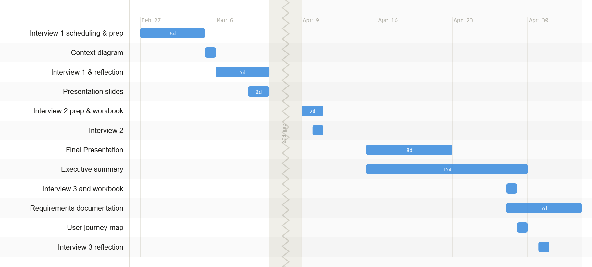

# SOFT468 Requirements Documents

**Project:** Cochlear Implant Research Lab Mobile Audio Test *(Senior Design Team)*

**Members:** Ethan Olson, Colin Salem, Adam Furniss, Parker Davids, Kyle Bradley

The goal of this project is to create an easy-to-administer, web-based hearing testing application that community health workers can run from a smartphone or tablet, coupled to a pair of headphones. This product will be used by CHWs to test the feasibility of increasing hearing loss identification and referral for treatment. The test will be automated and will not require specialized knowledge on the part of the user.

## Table of Contents

1. [Background](background.md)
2. [System Overview](system_overview.md)
3. [Interviews & Users](users.md)
4. [Project Goals](goals.md)
5. [Glossary](glossary.md)
6. [Contributions](contributions.md)

## Timeline

## AI Disclosure

AI Use Disclosure: AI models were used to generate the baselines for some charts such as the goal refinement graph and Gantt chart. All AI materials were double-checked and edited to ensure correctness before use. 

---

|  |  | [➡️](background.md) |
|:---------------:|:----------------------------:|:--------------------------------------------:|
|  |  | [Background](background.md) |
