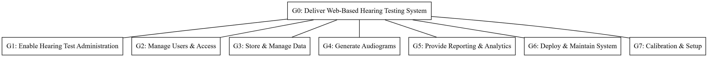
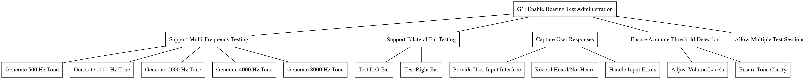
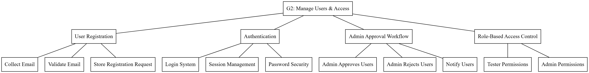
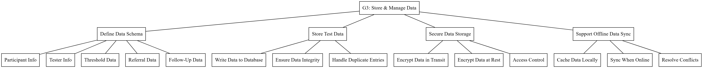
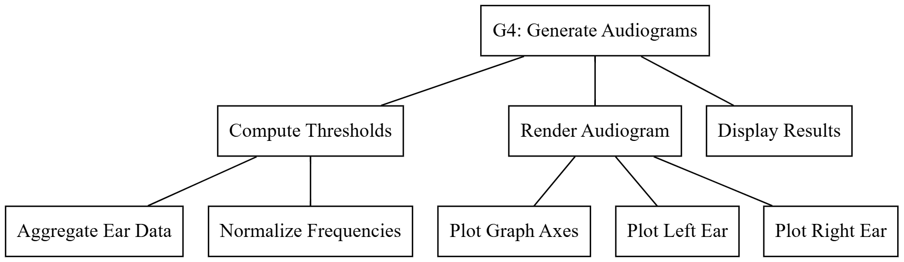
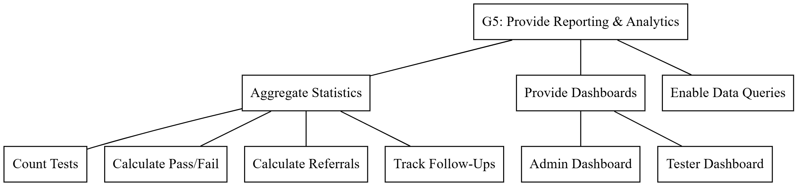
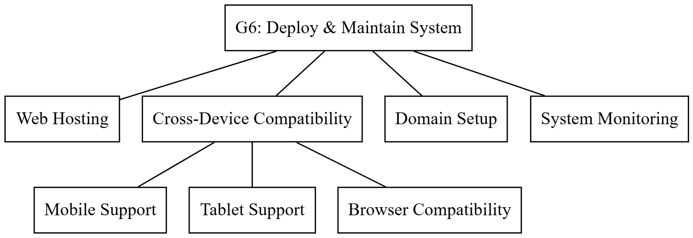
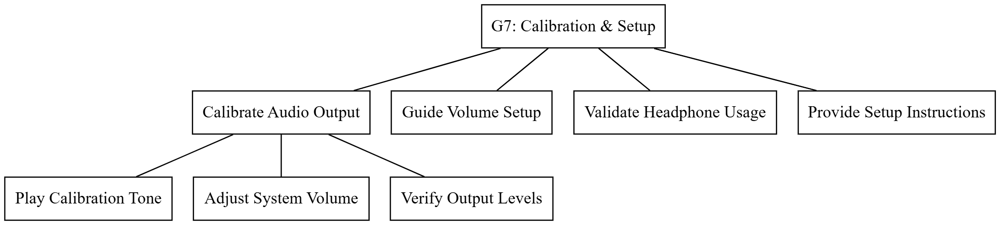
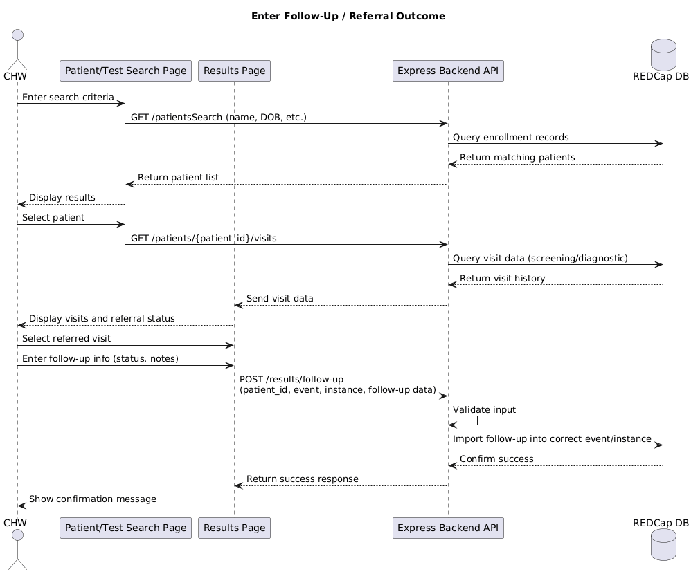
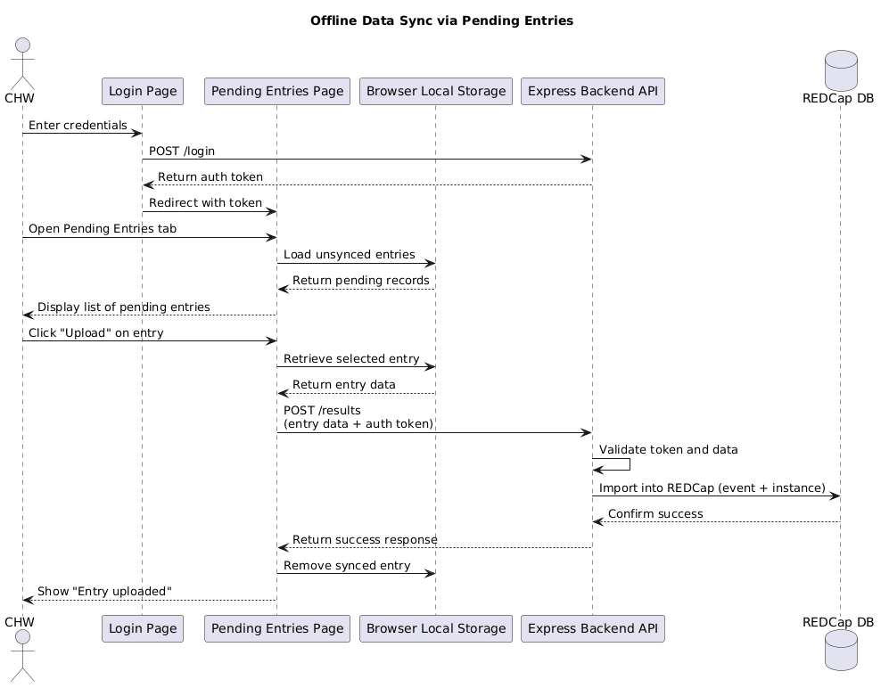

# Goals

The system is structured around the following primary goals:

- **G1:** Enable Hearing Test Administration  
- **G2:** Manage Users & Access  
- **G3:** Store & Manage Data  
- **G4:** Generate Audiograms  
- **G5:** Provide Reporting & Analytics  
- **G6:** Deploy & Maintain System  
- **G7:** Calibration & Setup  

## Functional Requirements

### FR1 – Hearing Test Initialization (G1)

- Given an approved tester is logged into the system  
  When the tester clicks "Start Test"  
  Then a new hearing test session is created  

- Given a new hearing test session is created  
  When the session begins  
  Then the system initializes left and right ear testing sequences  

- Given a test session has been created  
  When the system stores the session  
  Then the session is uniquely identified and saved 

### FR2 – Multi-Frequency Tone Generation (G1)

- Given a hearing test is running  
  When tones are generated  
  Then tones at 500, 1000, 2000, 4000, and 8000 Hz are played  

- Given tones are being presented during a test  
  When playback occurs  
  Then each frequency is presented at least once per ear  

- Given tones are played  
  When playback is executed  
  Then playback occurs without system error

### FR3 – Bilateral Ear Testing (G1)

- Given a hearing test is in progress  
  When tones are presented  
  Then tones are delivered separately to the left and right ears  

- Given a participant responds to tones  
  When responses are recorded  
  Then each response is associated with the correct ear  

- Given test data is stored  
  When the data is retrieved  
  Then left and right ear results are clearly distinguishable 

### FR4 – User Response Capture (G1)

- Given a tone is played  
  When the user selects "Heard" or "Not Heard"  
  Then the response is recorded  

- Given a response is recorded  
  When the system stores the response  
  Then it is associated with the correct frequency and ear  

- Given tones are presented during a test  
  When each tone finishes  
  Then a response is recorded for that tone  

### FR5 – Threshold Recording (G1, G3)

- Given a hearing test is completed  
  When results are processed  
  Then threshold values exist for all tested frequencies  

- Given threshold values are calculated  
  When they are stored  
  Then each threshold is associated with the correct ear and test session  

- Given stored threshold data  
  When compared to recorded responses  
  Then the data matches exactly  

### FR6 – User Registration and Authentication (G2)

- Given a user submits a registration form with a valid email  
  When the form is processed  
  Then a registration request is stored  

- Given an administrator approves a registration request  
  When the user attempts to log in  
  Then the user is able to log in successfully  

- Given a user is not approved  
  When the user attempts to log in  
  Then access is denied  

- Given a user is logged in  
  When the user accesses a protected page  
  Then access is granted only if the user is authenticated 

### FR7 – Admin Approval Workflow (G2)

- Given an administrator views pending users  
  When the administrator selects a user and approves or denies them  
  Then the system updates the user’s status accordingly  

- Given a user has been approved  
  When the user logs in  
  Then access to testing features is enabled  

- Given a user has been denied  
  When the user attempts to log in  
  Then access is denied  

- Given an administrator makes a decision  
  When the action is completed  
  Then the system records the approval or denial decision  

### FR8 – Data Storage (G3)

- Given a test is completed  
  When the results are submitted  
  Then the test data is written to the database  

- Given data is stored in the system  
  When the data is inspected  
  Then it includes participant, tester, thresholds, referrals, and timestamps  

- Given stored data is retrieved  
  When it is compared to original input  
  Then the retrieved data matches exactly 

### FR9 – Offline Data Handling (G3)

- Given the system is offline  
  When a test is completed  
  Then the test data is stored locally  

- Given internet connectivity is restored  
  When synchronization occurs  
  Then locally stored data is uploaded to the server  

- Given data synchronization is complete  
  When data integrity is checked  
  Then no test data is lost  

### FR10 – Audiogram Generation (G4)

- Given a hearing test is completed  
  When results are finalized  
  Then an audiogram is displayed on screen  

- Given an audiogram is displayed  
  When it is rendered  
  Then it includes plotted values for all five frequencies  

- Given audiogram data is displayed  
  When visualized  
  Then left and right ear data are clearly distinguishable 

### FR11 – Reporting and Statistics (G5)

- Given a user requests a report  
  When the system processes the request  
  Then total tests, pass/fail counts, and referrals are displayed  

- Given statistics are displayed  
  When compared to stored data  
  Then the values match exactly  

- Given new data is added to the system  
  When reports are generated  
  Then the reports reflect updated values  

### FR12 – Data Querying (G5)

- Given a user submits a query  
  When the system executes the query  
  Then a matching dataset is returned  

- Given query results are returned  
  When compared to query parameters  
  Then the results correspond to those parameters  

- Given a user is not authorized  
  When they attempt to query data  
  Then no unauthorized data is returned  

### FR13 – System Deployment (G6)

- Given a user accesses the system via a web browser  
  When the application loads  
  Then it loads successfully  

- Given the system is deployed  
  When accessed via its domain  
  Then it is reachable  

- Given the system is accessed on a supported device  
  When core features are used  
  Then they function correctly  

### FR14 – Cross-Device Compatibility (G6)

- Given a user accesses the system on a mobile or tablet device  
  When the interface loads  
  Then the UI renders correctly  

- Given a user is using a mobile or tablet device  
  When completing a full test workflow  
  Then the workflow completes without failure  

### FR15 – Calibration and Setup (G7)

- Given a user initiates calibration  
  When calibration begins  
  Then a calibration tone is played  

- Given a calibration tone is playing  
  When the user adjusts volume  
  Then the system proceeds only after confirmation  

- Given calibration is required  
  When calibration completes  
  Then the test is allowed to begin 

### FR16 – Setup Guidance (G7)

- Given a user is about to begin testing  
  When the system prepares the test  
  Then setup instructions are displayed  

- Given instructions are displayed  
  When the user acknowledges them  
  Then the test proceeds  

- Given setup instructions are shown  
  When reviewed  
  Then they include headphone usage and environment guidance 

## Quality Requirements

### QR1 – Usability
The system shall be usable by non-experts.

**Fit Criteria:**
- ≥ 90% of users complete a test without assistance.
- First-time users complete test in under 10 minutes.

### QR2 – Security & Privacy
The system shall protect sensitive data.

**Fit Criteria:**
- 100% of data transmissions use HTTPS encryption.
- Unauthorized data access occurs in < 0.0001% of cases.

### QR3 – Reliability
The system shall reliably store and preserve data.

**Fit Criteria:**
- ≥ 99.9% of test sessions are stored without data loss.
- System recovers data after interruption in ≥ 99% of cases.

### QR4 – Performance Efficiency
The system shall respond quickly.

**Fit Criteria:**
- Audiogram appears within 2 seconds after test completion.
- UI interactions respond within 1 second.

### QR5 – Functional Accuracy
The system shall correctly perform hearing test operations.

**Fit Criteria:**
- 100% of recorded thresholds match user input.
- All five frequencies are tested for both ears in every session.

### QR6 – Data Accessibility
The system shall provide timely access to data.

**Fit Criteria:**
- Queries return results within 2 seconds.
- ≥ 95% of queries return correct data.

### QR7 – Compatibility
The system shall function across environments.

**Fit Criteria:**
- ≥ 95% of tested devices successfully run the system.
- No critical errors occur on supported browsers.

## Domain Assumptions

- CHWs have access to a compatible device (smartphone or tablet).
- CHWs have access to functional headphones.
- Users can follow on-screen instructions.
- Internet access is available at least intermittently.
- CHWs have valid email accounts.
- Participants can respond to audio prompts.
- Testing environments are reasonably quiet.
- CHWs will complete follow-up data entry when required.

## Goal Refinement
Here is the full goal refinement graph:

Due to how large it is, it's barely readable. So I've split it into the individual goals for easier access. We will start with the Main Tree, showing Goal 0.

Goal 0 Tree:

Goal 1 Tree:

Goal 2 Tree:

Goal 3 Tree:

Goal 4 Tree:

Goal 5 Tree:

Goal 6 Tree:

Goal 7 Tree:

## Sequence Diagrams

Sequence diagram showing the process of administering a hearing screening/test:

Sequence diagram showing the process of entering patient follow up information

Sequence diagram showing the process of saving patient data collected offline

---

| [⬅️](users.md) | [⬆️](README.md) | [➡️](glossary.md) |
|:---------------:|:----------------------------:|:--------------------------------------------:|
| [Interviews & Users](users.md) | [Front Matter](README.md) | [Glossary](glossary.md) |

