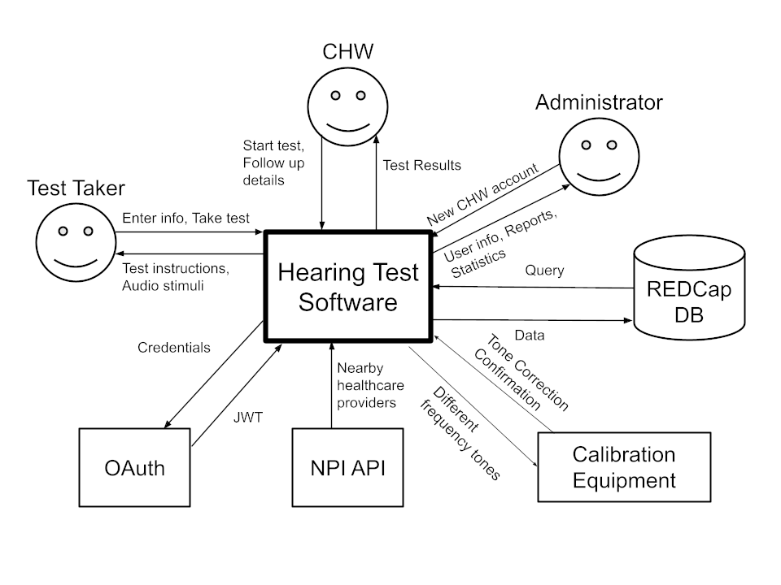
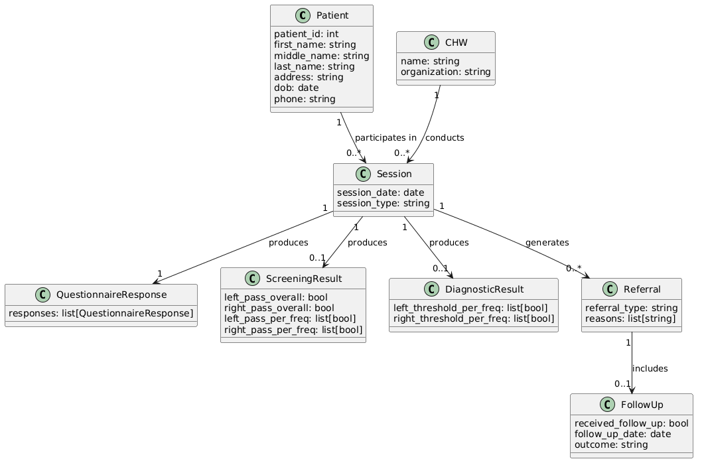

# System Overview

## Phenomena
### World Phenomena
- **WP1:** User's ability to hear specific frequencies
- **WP2:** The ambient noise of the user's surroundings
- **WP3:** The system plays a frequency
### Machine Phenomena
- **MP1:** The testing settings and set up are preformed by a CHW
- **MP2:** The results and data are processed
- **MP3:** The system uploads data to a secure cloud
- **MP4:** The system selects when to play the next frequency
- **MP5:** The CHW logs in to the system
- **MP6:** The system stores test results in a secure local database
### Shared Phenomena
- **SP1:** The headphones used for testing are working properly
- **SP2:** The frequencies are being correctly played over the headphones
- **SP3:** The user presses the button to indicate they heard a frequency 
- **SP4:** The system outputs results charts 

## The System
The System will provide an end-to-end hearing screening workflow: a CHW initiates a session, and then hands off the device to the patient so that they can enter their demographics, complete a questionnaire, and then the CHW sets up the device to complete either a full diagnostic hearing test or a hearing screening. Upon completion of the hearing test, the system will generate a visual representation of the results and will generate referrals to nearby healthcare providers based on the questionnaire responses and test results. CHWs can later log whether a referral was followed up on by the patient.
The system will not provide medical diagnoses or treatment plans. It is not designed to integrate with Electronic Health Records (EHR) systems and does not support bone-conduction testing, only air-conduction testing via calibrated headphones is within scope. The application is not intended to replace clinical audiology evaluations, but rather to serve as an accessible first step that connects patients to the care they need.

### Context Diagram

### Conceptual Model

### System Constraints
The system is designed with the following conditions in mind:
- CHWs are assumed to have access to a compatible device, a supported pair of headphones, and a valid email address.
- While an active internet connection is required to submit and sync test data, the system is designed to support use without an active internet connection.
- CHWs are expected to return to the system after confirming the status of patient follow-up to record outcomes.
- The application is legally required to comply with HIPAA standards.
- The system relies on an external API to identify nearby healthcare providers for referrals, uses OAuth for secure user authentication, and uses REDCap for secure data storage.
- The system is designed so that its underlying database can be replaced or migrated in the future without requiring a full rebuild.

## Security Concerns
### Risks/Uncertainties/Challenges and Mitigation Plan
#### Offline Data Loss Risk
CHWs often operate in environments with little to no connectivity. Ensuring that any data they collect is not lost is of the upmost importance.

Mitigation Plan:
  - Store results locally
  - Notify user of any failed upload
#### User Input Errors During Testing
Users may input incorrect information when completing the test.

Mitigation Plan:
  - Allow users to go back and change their answers.
  - Use dropdowns instead of free-text when possible
  - Have validation rules for free text options

### Security Issues
#### Must store patient data securely
Sensitive patient data needs to be stored securely in order to be compliant with federal regualtions (i.e. HIPAA)

Mitigation Plan:
  - Use REDCap database, which is already HIPAA compliant.
  - Use other industry standard security measures, such as HTTPS and input validation.
#### Must have a role-based login system
CHWs should only be able to access the patient data of patients that they have tested.

Mitigation Plan:
  - Auth0 authentication system. Each CHW belongs to an organization, and can only access patients with that organization.
  - Introduce separate permissions for CHWs vs Admins.

## Other Solutions
A variety of other solutions exist for mobile hearing screenings. However, these screenings are typically preformed as an employee benefit at a workplace and are sponsored by an employer. Man companies offer systems like these, including: [Audiometric Associates](https://audiometricassociates.com/on-site-mobile-testing), [Workplace Integra](https://www.workplaceintegra.com/on-site-mobile-audiometric-testing), and [ASI Health Services](https://www.asihealthservices.com/).

Our system focuses on testing individuals in areas that are underserved, rural, or otherwise lack access to conventional hearing services. In this area there are few existing companies that offer these services. Companies that offer these sercives, like [KY Hears](https://kyhears.org/mobile-hearing-clinic/), typically serve only a small area with a mobile test trailer.

---

| [⬅️](background.md) | [⬆️](README.md) | [➡️](users.md) |
|:---------------:|:----------------------------:|:--------------------------------------------:|
| [Background](background.md) | [Front Matter](README.md) | [Interviews & Users](users.md) |
